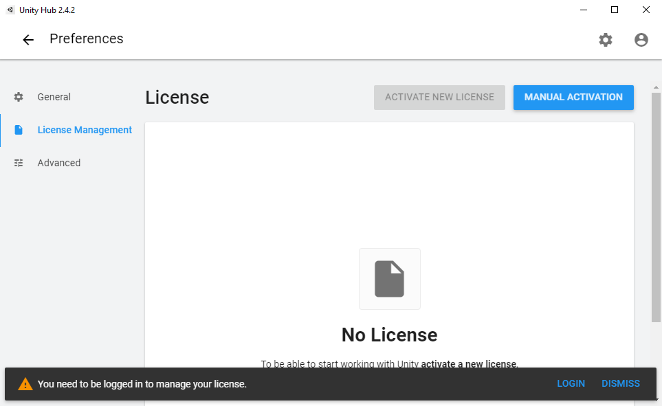
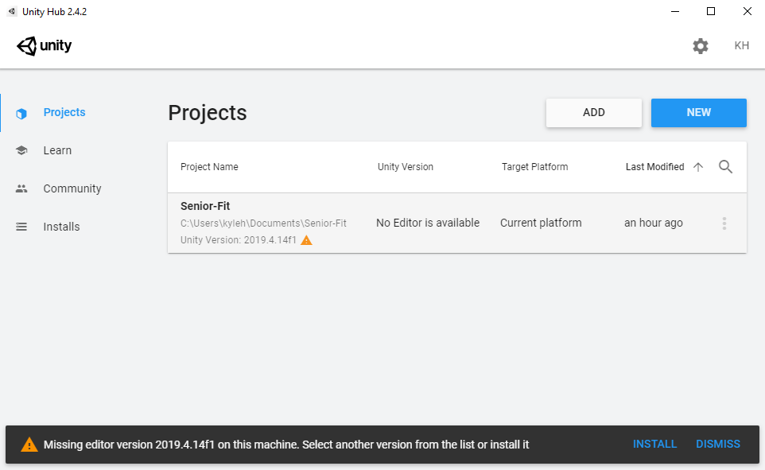
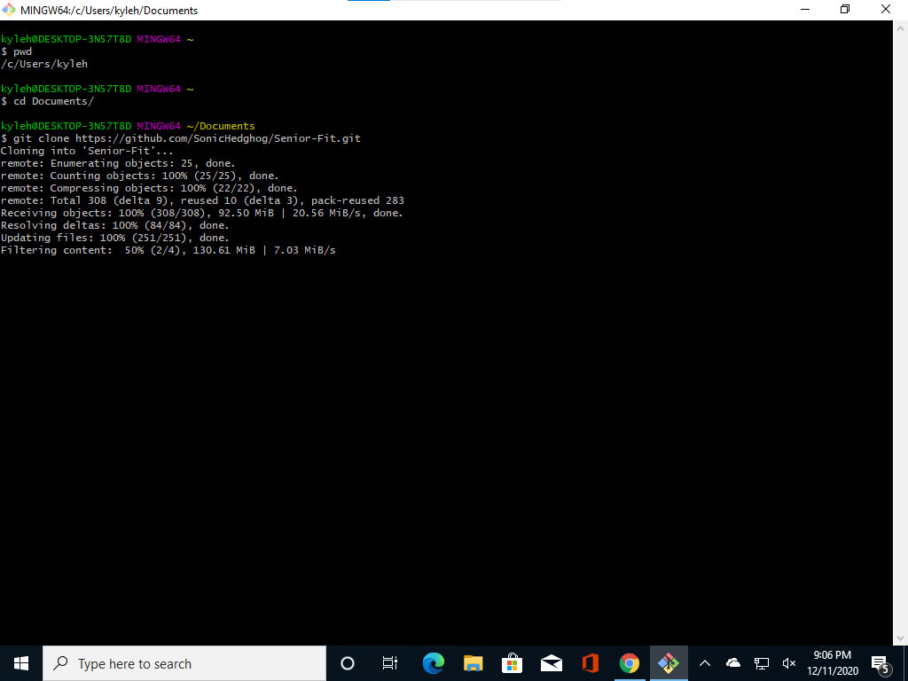

# Senior-Fit 
An AR exercising app for ages 65+.
## Development Environment
- [Unity 2019.4.14f1](https://unity3d.com/unity/whats-new/2019.4.14)
- [TensorFlow Lite for Unity](https://openupm.com/packages/com.github.asus4.tflite/)  
- Samsung Galaxy S9

## Set Up
* Clone the Repository:
  * To work around a LFS issue, use the following command to only clone the current development branch:
    * `git clone --branch blaze-pose https://github.com/SonicHedghog/Senior-Fit.git`
* Download Unity Hub (link above) 
  * You will need to login or create an account and set up a license before going forward

* In Project Tab, click Add and import the `Senior-Fit` Project Folder
  * To install Unity 2019.4.14f1 LTS, click on the project to recieve a pop-up asking to install the required unity verion. Make sure to click `Install`

* Select both Android (as well as its packages) and iOS Build Support on the modules screen. Then click `Install`.

* Go to Projects Tab and open the project
* In the Project explorer: Open the `\Assets\Scenes\MainMenu.unity` file
* Run the Scene by pressing the run button

# Older Instructions

* You will then need to follow [these instructions](https://openupm.com/packages/com.github.asus4.tflite/#build-tensorflow-lite-libraries:~:text=Build%20TensorFlow%20Lite%20libraries) to get everything working properly. 

  * Make sure to download all of the following to complete those instructions:
    1. [Bazel](https://docs.bazel.build/versions/3.7.0/install.html)
    2. [Python 3.7](https://www.python.org/downloads/)

  * Note: Make sure to put the tensorflow repository in the same folder as the Senior Fit folder in order for the last command to work. If the last command produces an error, that doesn't neccessarily mean that the comman didn't work. Also, make sure `build_tflite.py` is spelled correctly.

* Download and open the TensorFlow Lite package above. 
  * A popup asking to include files pops up in the Unity window. Just press ok

## Reporting Issues

If you have any problems, please reach out or post your problem in the Issues if it's appropriate.
