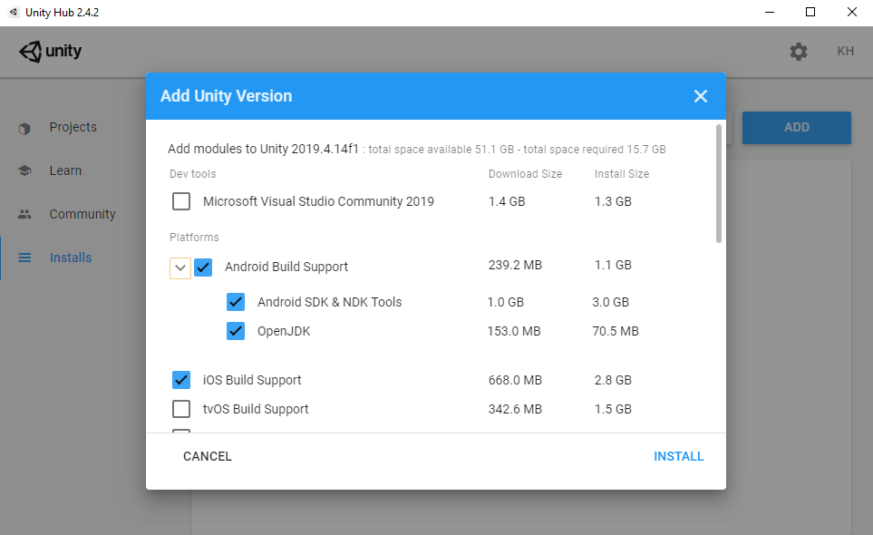

# Senior-Fit 
An AR exercising app for ages 65+.
## Development Environment
- [Unity 2019.4.14f1](https://unity3d.com/get-unity/download)
  - [TensorFlow Lite for Unity](https://openupm.com/packages/com.github.asus4.tflite/)
  
- Samsung Galaxy S9

## Set Up
* Clone the Repository

* Download Unity Hub (link above) 

  * You will need to login or create an account and set up a license before going forward
  

* In Project Tab, click Add and import the `Senior-Fit` Project Folder

  * To install Unity 2019.4.14f1 LTS, click on the project to recieve a pop-up asking to install the required unity verion. Make sure to click `Install`

* Select both Android (as well as its packages) and iOS Build Support on the modules screen. Then click `Install`.

* Go to Projects Tab and open the project

* Download and open the TensorFlow Lite package above. 

  * A popup asking to include files pops up in the Unity window. Just press ok
  
* Open the `\Assets\Scenes\PoseNet\WorkoutSpace.unity` file

* Run the Scene by pressing the run button

## Reporting Issues

If you have any problems, please reach out or post your problem in the Issues if it's appropriate.
